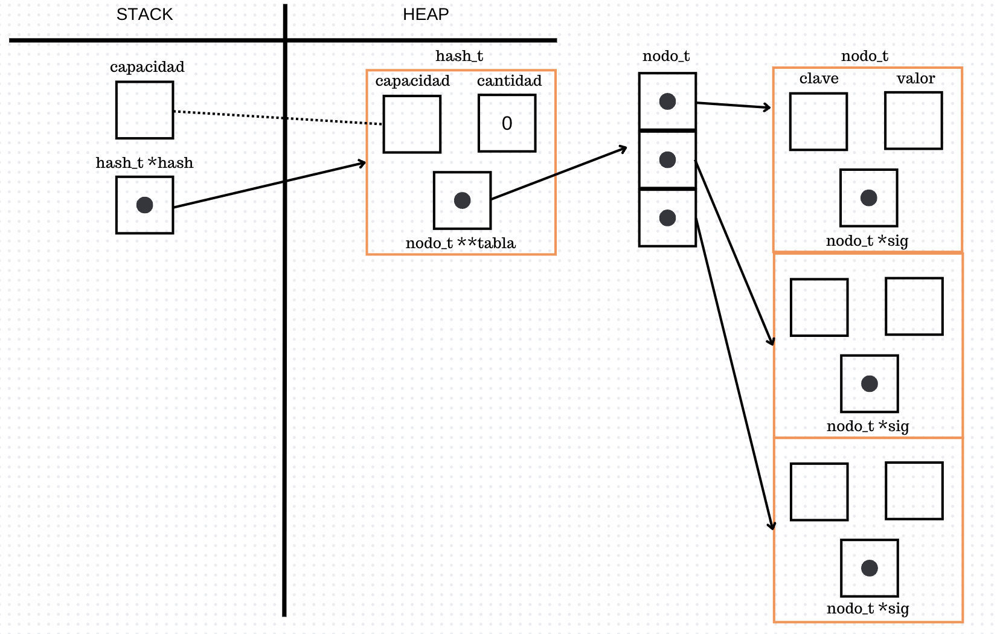
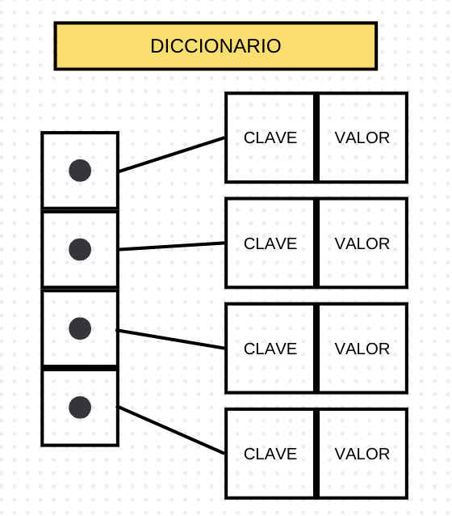
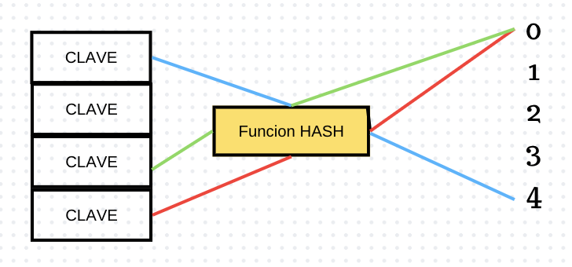
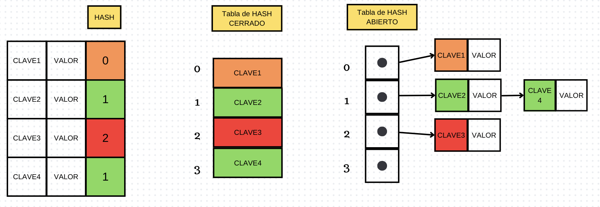

<div align="right">

</div>

# TDA HASH

## Repositorio de Renata Bruno - 106860 - rc.brunoo@gmail.com

- Para compilar:

```bash
gcc -o pruebas_alumno pruebas_alumno.c
```

- Para ejecutar:

```bash
./pruebas_alumno 
```

- Para ejecutar con valgrind:
```bash
valgrind ./pruebas_alumno 
```
---
##  Funcionamiento
La función `hash_crear` utiliza `malloc` para asignar memoria en el heap para un nuevo hash_t y lo guardo en el puntero de hash, en caso de error retorno NULL. 

```c
hash_t *hash = malloc(sizeof(hash_t));

if (!hash)
    return NULL;
```

Luego, asigno memoria en el heap utilizando `calloc` para un vector de punteros a nodo_t, el número de elementos en este array es igual a capacidad, y el tamaño de cada elemento es el tamaño de un puntero a nodo_t. Esto lo guardo en el puntero de `hash->tabla`, en caso de error retorno NULL y libero la memoria asignada anteriormente.

```c
hash->tabla = calloc(capacidad, sizeof(nodo_t *));

if (!hash->tabla) {
    free(hash);
    return NULL;
}
```

Por último, inicializo los valores del hash y retorno el hash creado.

```c
hash->capacidad = capacidad;
hash->cantidad = 0;
return hash;
```


<div align="center">

</div>

---

## Respuestas a las preguntas teóricas
- ¿Qué es un diccionario?
    Un diccionario es una estructura de datos que permite almacenar y recuperar datos de manera eficiente, de la forma clave-valor. La clave es un identificador único que permite acceder a un valor asociado a la misma. 

<div align="center">

</div>

- ¿Qué es una función de hash y qué características debe tener?
    Una función de hash es una función que permite transformar una clave en un valor de hash, normalmente es un numero asociado. Debe ser determinística, es decir, que para una misma clave siempre devuelva el mismo numero.

<div align="center">

</div>

- ¿Qué es una tabla de Hash y los diferentes métodos de resolución de colisiones vistos (encadenamiento, probing, zona de desborde)?
    La tabla de hash es una estructura que contiene valores, donde puedo acceder a los mismos a través de una clave.
    Los diferentes métodos de resolución de colisiones son:
    - Encadenamiento: Se utiliza una lista enlazada para almacenar los elementos que colisionan.
    - Probing: Se busca el siguiente espacio libre inmediato donde se almacena el elemento de colisión.
    - Zona de desborde: Se utiliza una zona de la tabla de hash para almacenar los elementos que colisionan.
<div align="center">

</div>